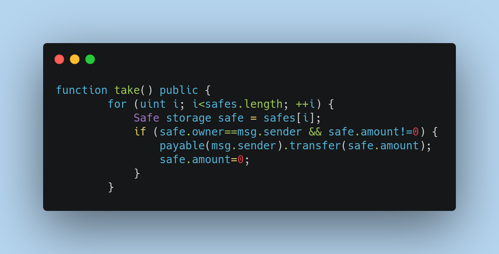
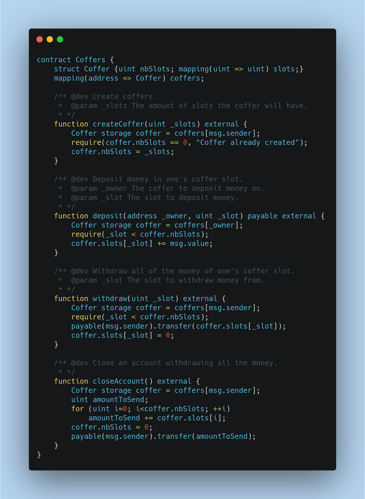

# Smart Contract Code Review : 
In this Document, an audit report for the SmartContracts.sol code, General requirements and much more. 

---

# Agenda : 
  * General requirements/Needs 
  * Code Review
  * Vulnerabilities assessments 
---

# General Requirements : 

Note: In the SmartContracts.sol none of the contracts use [SafeMath](https://github.com/ConsenSysMesh/openzeppelin-solidity/blob/master/contracts/math/SafeMath.sol)

When your are working with numbers in any programming language you are subject to overflows. An overflow happens when the value of number is bigger than the maximum possible value offered by the machine.
In solidity smart contract programming also, To prevent this kind of problems in your code we advise you to always use the [SafeMath](https://medium.com/coinmonks/practicing-safemath-with-solidity-and-openzeppelin-cde4cba9ce39) library when you’re dealing with number operations.

The library will help you check for overflows in case of addition, underflow in case of substractions as well as when performing multiplications and divisions.

---

# Exercice 1 :

----

# Code Review 


  * In this smart contract, the functions visibility set to public, so any attacker can create an attack.sol smart and call the functions store and take, especially in the take function, the attacker can transfert the stored ethers to a specific address, => vulnerability
----

# Vulnerabilities Assessments 



  * In this function, the loop can affect the unconditional transfert of ethers, while there's no condition for the <big>payable()</big> call.
---

# Ex 2 :

----

# Code Review 

The goal of this contract is to get the price of something to buy.
Buyer will be able to get a discount to withdraw all the Ether.
Contributers in this contract deposit 1 ether each, one can get a discount to buy. 
----

# Vulnerabilities Assessments 
what happened ? 
Attack forced the balance of DiscountedBuy to equal the base price 1 ether. Now no one can deposit and the ethers winner cannot be set.

With the selfdestruct() the attacker can specify a beneficiary to send the ethers => bingo vulnerability

---

# Ex 3 :

----

# Code Review 


----

# Vulnerabilities Assessments 
You can lose ether in this contract.
Transaction-Ordering Attack : A transaction-ordering attack will change the price during the processing of your transaction because some one else (the contract owner, miner or another user) has sent a transaction modifying the price before your transaction is complete.
The interferance of two transaction affect users to lose their amount of ether in their contribution in this contract.
---

# Ex 4 :

----

# Code Review 


----

# Vulnerabilities Assessments 
front running attack : displacement code : this attack is very known in smart contract:
[dao attack](https://medium.com/@MyPaoG/explaining-the-dao-exploit-for-beginners-in-solidity-80ee84f0d470)
---


# Ex 5 :

----

# Code Review 


----

# Vulnerabilities Assessments 


the attacker can overflow the timeout function, the two first lines in the function can be eliminated , and the attacker send the amount of ether to a specific wallet from an attack contract.

---


# Ex 6 :

----

# Code Review 


----

# Vulnerabilities Assessments 


Front-running Attack : 
This function can destroy the contract, no constraints for the contribution, an attacker can just deposit a uncontrable amount of gas and just destroy the contract.

Before add and substract the amount from the sender to the recipient , the sender can have 0 = underflow, recipient gain ether from nothing => unprocessable.

---


# Ex 7 :

----

# Code Review 


----

# Vulnerabilities Assessments 


---


# Ex 8 :

----

# Code Review 


----

# Vulnerabilities Assessments 


these two lines affect reentrancy attack (the most known attack of displacement lines of code)
---


# Ex 9 :

----

# Code Review 


----

# Vulnerabilities Assessments 

scalingFactor should set to initial amount, this variable is public any atacker can play with the scalingFactor and change the conditional statement, while the contract is vulnerable by transerring the ether in the withdraw function to any attac contract.

---


# Ex 10 :

----

# Code Review 


----

# Vulnerabilities Assessments 

---

<!--

# Ex 11 :

----

# Code Review 


----

# Vulnerabilities Assessments 

---


# Ex 12 :

----

# Code Review 


----

# Vulnerabilities Assessments 


---
# Ex 13 :

----

# Code Review 


----

# Vulnerabilities Assessments 

---


-->


---
# Mythril Result : 
```
└──╼ $myth analyze SmartContracts.sol --solv 0.8.0
==== External Call To User-Supplied Address ====
SWC ID: 107
Severity: Low
Contract: Vault
Function name: redeem()
PC address: 373
Estimated Gas Usage: 7115 - 61776
A call to a user-supplied address is executed.
An external message call to an address specified by the caller is executed. Note that the callee account might contain arbitrary code and could re-enter any function within this contract. Reentering the contract in an intermediate state may lead to unexpected behaviour. Make sure that no state modifications are executed after this call and/or reentrancy guards are in place.
--------------------
In file: SmartContracts.sol:115

msg.sender.call{ value: balances[msg.sender] }("")

--------------------
Initial State:

Account: [CREATOR], balance: 0x20210, nonce:0, storage:{}
Account: [ATTACKER], balance: 0x1, nonce:0, storage:{}
Account: [SOMEGUY], balance: 0x0, nonce:0, storage:{}

Transaction Sequence:

Caller: [CREATOR], calldata: , value: 0x0
Caller: [ATTACKER], function: redeem(), txdata: 0xbe040fb0, value: 0x0
Caller: [ATTACKER], function: redeem(), txdata: 0xbe040fb0, value: 0x0

==== Unchecked return value from external call. ====
SWC ID: 104
Severity: Medium
Contract: Vault
Function name: redeem()
PC address: 373
Estimated Gas Usage: 7188 - 62132
The return value of a message call is not checked.
External calls return a boolean value. If the callee halts with an exception, 'false' is returned and execution continues in the caller. The caller should check whether an exception happened and react accordingly to avoid unexpected behavior. For example it is often desirable to wrap external calls in require() so the transaction is reverted if the call fails.
--------------------
In file: SmartContracts.sol:115

msg.sender.call{ value: balances[msg.sender] }("")

--------------------
Initial State:

Account: [CREATOR], balance: 0xa068e, nonce:0, storage:{}
Account: [ATTACKER], balance: 0x0, nonce:0, storage:{}
Account: [SOMEGUY], balance: 0x0, nonce:0, storage:{}

Transaction Sequence:

Caller: [CREATOR], calldata: , value: 0x0
Caller: [ATTACKER], function: redeem(), txdata: 0xbe040fb0, value: 0x0
Caller: [SOMEGUY], function: redeem(), txdata: 0xbe040fb0, value: 0x0

==== Unprotected Ether Withdrawal ====
SWC ID: 105
Severity: High
Contract: HeadOrTail
Function name: guess(bool)
PC address: 391
Estimated Gas Usage: 8837 - 64108
Any sender can withdraw Ether from the contract account.
Arbitrary senders other than the contract creator can profitably extract Ether from the contract account. Verify the business logic carefully and make sure that appropriate security controls are in place to prevent unexpected loss of funds.
--------------------
In file: SmartContracts.sol:95

payable(msg.sender).transfer(2 ether)

--------------------
Initial State:

Account: [CREATOR], balance: 0x100000000000328, nonce:0, storage:{}
Account: [ATTACKER], balance: 0x2000000000400008, nonce:0, storage:{}
Account: [SOMEGUY], balance: 0x0, nonce:0, storage:{}

Transaction Sequence:

Caller: [CREATOR], calldata: , value: 0x0
Caller: [SOMEGUY], function: choose(bool), txdata: 0xf6e00e0f0000000000000000000000000000000000000000000000000000000000000000, value: 0xde0b6b3a7640000
Caller: [ATTACKER], function: guess(bool), txdata: 0xe0a8f09a0000000000000000000000000000000000000000000000000000000000000000, value: 0xde0b6b3a7640000

==== State access after external call ====
SWC ID: 107
Severity: Medium
Contract: Vault
Function name: redeem()
PC address: 496
Estimated Gas Usage: 7115 - 61776
Write to persistent state following external call
The contract account state is accessed after an external call to a user defined address. To prevent reentrancy issues, consider accessing the state only before the call, especially if the callee is untrusted. Alternatively, a reentrancy lock can be used to prevent untrusted callees from re-entering the contract in an intermediate state.
--------------------
In file: SmartContracts.sol:116

balances[msg.sender]=0

--------------------
Initial State:

Account: [CREATOR], balance: 0x3fffffffffffffffe, nonce:0, storage:{}
Account: [ATTACKER], balance: 0x3fffffffffffffffd, nonce:0, storage:{}
Account: [SOMEGUY], balance: 0x0, nonce:0, storage:{}

Transaction Sequence:

Caller: [CREATOR], calldata: , value: 0x0
Caller: [ATTACKER], function: redeem(), txdata: 0xbe040fb0, value: 0x0

==== Dependence on predictable environment variable ====
SWC ID: 116
Severity: Low
Contract: HeadTail
Function name: timeOut()
PC address: 538
Estimated Gas Usage: 1207 - 1302
A control flow decision is made based on The block.timestamp environment variable.
The block.timestamp environment variable is used to determine a control flow decision. Note that the values of variables like coinbase, gaslimit, block number and timestamp are predictable and can be manipulated by a malicious miner. Also keep in mind that attackers know hashes of earlier blocks. Don't use any of those environment variables as sources of randomness and be aware that use of these variables introduces a certain level of trust into miners.
--------------------
In file: SmartContracts.sol:174

require(block.timestamp > timeB + 1 days)

--------------------
Initial State:

Account: [CREATOR], balance: 0x28405c2441040006, nonce:0, storage:{}
Account: [ATTACKER], balance: 0x0, nonce:0, storage:{}
Account: [SOMEGUY], balance: 0x0, nonce:0, storage:{}

Transaction Sequence:

Caller: [CREATOR], calldata: 000000000000000000000000000000000000000000000000000000000000000000000000000000000000000000000000000000000000000000000000000000000000000000000000000000000000000000000000000000000000000000000000000000000000000000000000000000000000000000000000000000000000000000000000000000000000000000000000000000000000000000000000000000000000000000000000000000000000000000000000000000000000000000000000000000000000000000000000000000000000000000000000000000000000000000000000000000000000000000000000000000000000000000000000000000000000000000000000000000000000000000000000000000000000000000000000000000000000000000000000000000000000000000000000000000000000000000000000000000000000000000000000000000000000000000000000000000000000000000000000000000000000000000000000000000000000000000000000000000000000000000000000000000000000000000000000000000000000000000000000000000000000000000000000000000000000000000000000000000000000000000000000000000000000000000000000000000000000000000000000000000000000000000000000000000000000000000000000000000000000000000000000000000000000000000000000000000000000000000000000000000000000000000000000000000000000000000000000000000000000000000000000000000000000000000000000000000000000000000000000000000000000000000000000000000000000000000000000000000000000000000000000000000000000000000000000000000000000000000000000000000000000000000000000000000000000000000000000000000000000000000000000000000000000000000000000000000000000000000000000000000000000000000000000000000000000000000000000000000000000000000000000000000000000000000000000000000000000000000000000000000000000000000000000000000000000000000000000000000000000000000000000000000000000000000000000000000000000000000000000000000000000000000000000000000000000000000000000000000000000000000000000000000000000000000000000000000000000000000000000000000000000000000000000000000000000000000000000000000000000000000000000000000000000000000000000000000000000000000000000000000000000000000000000000000000000000000000000000000000000000000000000000000000000000000000000000000000000000000000000000000000000000000000000000000000000000000000000000000000000000000000000000000000000000000000000000000000000000000000000000000000000000000000000000000000000000000000000000000000000000000000000000000000000000000000000000000000000000000000000000000000000000000000000000000000000000000000000000000000000000000000000000000000000000000000000000000000000000000000000000000000000000000000000000000000000000000000000000000000000000000000000000000000000000000000000000000000000000000000000000000000000000000000000000000000000000000000000000000000000000000000000000000000000000000000000000000000000000000000000000000000000000000000000000000000000000000000000000000000000000000000000000000000000000000000000000000000000000000000000000000000000000000000000000000000000000000000000000000000000000000000000000000000000000000000000000000000000000000000000000000000000000000000000000000000000000000000000000000000000000000000000000000000000000000000000000000000000000000000000000000000000000000000000000000000000000000000000000000000000000000000000000000000000000000000000000000000000000000000000000000000000000000000000000000000000000000000000000000000000000000000000000000000000000000000000000000000000000000000000000000000000000000000000000000000000000000000000000000000000000000000000000000000000000000000000000000000000000000000000000000000000000000000000000000000000000000000000000000000000000000000000000000000000000000000000000000000000000000000000000000000000000000000000000000000000000000000000000000000000000000000000000000000000000000000000000000000000000000000000000000000000000000000000000000000000000000000000000000000000000000000000000000000000000000000000000000000000000000000000000000000000000000000000000000000000000000000000000000000000000000000000000000000000000000000000000000000000000000000000000000000000000000000000000000000000000000000000000000000000000000000000000000000000000000000000000000000000000000000000000000000000000000000000000000000000000000000000000000000000000000000000000000000000000000000000000000000000000000000000000000000000000000000000000000000000000000000000000000000000000000000000000000000000000000000000000000000000000000000000000000000000000000000000000000000000000000000000000000000000000000000000000000000000000000000000000000000000000000000000000000000000000000000000000000000000000000000000000000000000000000000000000000000000000000000000000000000000000000000000000000000000000000000000000000000000000000000000000000000000000000000000000000000000000000000000000000000000000000000000000000000000000000000000000000000000000000000000000000000000000000000000000000000000000000000000000000000000000000000000000000000000000000000000000000000000000000000000000000000000000000000000000000000000000000000000000000000000000000000000000000000000000000000000000000000000000000000000000000000000000000000000000000000000000000000000000000000000000000000000000000000000000000000000000000000000000000000000000000000000000000000000000000000000000000000000000000000000000000000000000000000000000000000000000000000000000000000000000000000000000000000000000000000000000000000000000000000000000000000000000000000000000000000000000000000000000000000000000000000000000000000000000000000000000000000000000000000000000000000000000000000000000000000000000000000000000000000000000000000000000000000000000000000000000000000000000000000000000000000000000000000000000000000000000000000000000000000000000000000000000000000000000000000000000000000000000000000000000000000000000000000000000000000000000000000000000000000000000000000000000000000000000000000000000000000000000000000000000000000000000000000000000000000000000000000000000000000000000000000000000000000000000000000000000000000000000000, value: 0xde0b6b3a7640000
Caller: [SOMEGUY], function: timeOut(), txdata: 0x614d85e1, value: 0x0

==== Integer Arithmetic Bugs ====
SWC ID: 101
Severity: High
Contract: SimpleToken
Function name: sendToken(address,int256)
PC address: 577
Estimated Gas Usage: 12945 - 53420
The arithmetic operator can underflow.
It is possible to cause an integer overflow or underflow in the arithmetic operation. 
--------------------
In file: #utility.yul:44

_inplace_fromStack(pos, length) -> updated_pos {
        updated_pos := po

--------------------
Initial State:

Account: [CREATOR], balance: 0x2000001, nonce:0, storage:{}
Account: [ATTACKER], balance: 0x200, nonce:0, storage:{}
Account: [SOMEGUY], balance: 0x0, nonce:0, storage:{}

Transaction Sequence:

Caller: [CREATOR], calldata: , value: 0x0
Caller: [ATTACKER], function: sendToken(address,int256), txdata: 0x0f7428b9000000000000000000000000deadbeefdeadbeefdeadbeefdeadbeefdeadbeef7f1ffa1fdfffa93fcb8800000000000000000000000000000000000000000000, value: 0x0

==== Integer Arithmetic Bugs ====
SWC ID: 101
Severity: High
Contract: SimpleToken
Function name: sendToken(address,int256)
PC address: 634
Estimated Gas Usage: 12945 - 53420
The arithmetic operator can underflow.
It is possible to cause an integer overflow or underflow in the arithmetic operation. 
--------------------
In file: #utility.yul:50

_t_uint256(y)

        // overflow, if x > (maxValue - y)
        if gt(x,

--------------------
Initial State:

Account: [CREATOR], balance: 0x8, nonce:0, storage:{}
Account: [ATTACKER], balance: 0x0, nonce:0, storage:{}
Account: [SOMEGUY], balance: 0x0, nonce:0, storage:{}

Transaction Sequence:

Caller: [CREATOR], calldata: , value: 0x0
Caller: [CREATOR], function: sendToken(address,int256), txdata: 0x0f7428b9000000000000000000000000affeaffeaffeaffeaffeaffeaffeaffeaffeaffe4000000000000000000000000000000000000000000000000000000020000000, value: 0x0

==== Unprotected Ether Withdrawal ====
SWC ID: 105
Severity: High
Contract: HeadTail
Function name: timeOut()
PC address: 654
Estimated Gas Usage: 2892 - 37503
Any sender can withdraw Ether from the contract account.
Arbitrary senders other than the contract creator can profitably extract Ether from the contract account. Verify the business logic carefully and make sure that appropriate security controls are in place to prevent unexpected loss of funds.
--------------------
In file: SmartContracts.sol:176

partyB.transfer(2 ether)

--------------------
Initial State:

Account: [CREATOR], balance: 0x40e00000000040002, nonce:0, storage:{}
Account: [ATTACKER], balance: 0x1100145c4280da780, nonce:0, storage:{}
Account: [SOMEGUY], balance: 0x0, nonce:0, storage:{}

Transaction Sequence:

Caller: [CREATOR], calldata: 000000000000000000000000000000000000000000000000000000000000000000000000000000000000000000000000000000000000000000000000000000000000000000000000000000000000000000000000000000000000000000000000000000000000000000000000000000000000000000000000000000000000000000000000000000000000000000000000000000000000000000000000000000000000000000000000000000000000000000000000000000000000000000000000000000000000000000000000000000000000000000000000000000000000000000000000000000000000000000000000000000000000000000000000000000000000000000000000000000000000000000000000000000000000000000000000000000000000000000000000000000000000000000000000000000000000000000000000000000000000000000000000000000000000000000000000000000000000000000000000000000000000000000000000000000000000000000000000000000000000000000000000000000000000000000000000000000000000000000000000000000000000000000000000000000000000000000000000000000000000000000000000000000000000000000000000000000000000000000000000000000000000000000000000000000000000000000000000000000000000000000000000000000000000000000000000000000000000000000000000000000000000000000000000000000000000000000000000000000000000000000000000000000000000000000000000000000000000000000000000000000000000000000000000000000000000000000000000000000000000000000000000000000000000000000000000000000000000000000000000000000000000000000000000000000000000000000000000000000000000000000000000000000000000000000000000000000000000000000000000000000000000000000000000000000000000000000000000000000000000000000000000000000000000000000000000000000000000000000000000000000000000000000000000000000000000000000000000000000000000000000000000000000000000000000000000000000000000000000000000000000000000000000000000000000000000000000000000000000000000000000000000000000000000000000000000000000000000000000000000000000000000000000000000000000000000000000000000000000000000000000000000000000000000000000000000000000000000000000000000000000000000000000000000000000000000000000000000000000000000000000000000000000000000000000000000000000000000000000000000000000000000000000000000000000000000000000000000000000000000000000000000000000000000000000000000000000000000000000000000000000000000000000000000000000000000000000000000000000000000000000000000000000000000000000000000000000000000000000000000000000000000000000000000000000000000000000000000000000000000000000000000000000000000000000000000000000000000000000000000000000000000000000000000000000000000000000000000000000000000000000000000000000000000000000000000000000000000000000000000000000000000000000000000000000000000000000000000000000000000000000000000000000000000000000000000000000000000000000000000000000000000000000000000000000000000000000000000000000000000000000000000000000000000000000000000000000000000000000000000000000000000000000000000000000000000000000000000000000000000000000000000000000000000000000000000000000000000000000000000000000000000000000000000000000000000000000000000000000000000000000000000000000000000000000000000000000000000000000000000000000000000000000000000000000000000000000000000000000000000000000000000000000000000000000000000000000000000000000000000000000000000000000000000000000000000000000000000000000000000000000000000000000000000000000000000000000000000000000000000000000000000000000000000000000000000000000000000000000000000000000000000000000000000000000000000000000000000000000000000000000000000000000000000000000000000000000000000000000000000000000000000000000000000000000000000000000000000000000000000000000000000000000000000000000000000000000000000000000000000000000000000000000000000000000000000000000000000000000000000000000000000000000000000000000000000000000000000000000000000000000000000000000000000000000000000000000000000000000000000000000000000000000000000000000000000000000000000000000000000000000000000000000000000000000000000000000000000000000000000000000000000000000000000000000000000000000000000000000000000000000000000000000000000000000000000000000000000000000000000000000000000000000000000000000000000000000000000000000000000000000000000000000000000000000000000000000000000000000000000000000000000000000000000000000000000000000000000000000000000000000000000000000000000000000000000000000000000000000000000000000000000000000000000000000000000000000000000000000000000000000000000000000000000000000000000000000000000000000000000000000000000000000000000000000000000000000000000000000000000000000000000000000000000000000000000000000000000000000000000000000000000000000000000000000000000000000000000000000000000000000000000000000000000000000000000000000000000000000000000000000000000000000000000000000000000000000000000000000000000000000000000000000000000000000000000000000000000000000000000000000000000000000000000000000000000000000000000000000000000000000000000000000000000000000000000000000000000000000000000000000000000000000000000000000000000000000000000000000000000000000000000000000000000000000000000000000000000000000000000000000000000000000000000000000000000000000000000000000000000000000000000000000000000000000000000000000000000000000000000000000000000000000000000000000000000000000000000000000000000000000000000000000000000000000000000000000000000000000000000000000000000000000000000000000000000000000000000000000000000000000000000000000000000000000000000000000000000000000000000000000000000000000000000000000000000000000000000000000000000000000000000000000000000000000000000000000000000000000000000000000000000000000000000000000000000000000000000000000000000000000000000000000000000000000000000000000000000000000000000000000000000000000000000000000000000000000000000000000000000000000000000000000000000000000000000000000000000000000000000000000000000000000000000000000000000000000000000000000000000000000000000000000000000000000000000000000, value: 0xde0b6b3a7640000
Caller: [ATTACKER], function: guess(bool), txdata: 0xe0a8f09a0000000000000000000000000000000000000000000000000000000000000001, value: 0xde0b6b3a7640000
Caller: [ATTACKER], function: timeOut(), txdata: 0x614d85e1, value: 0x0

==== Integer Arithmetic Bugs ====
SWC ID: 101
Severity: High
Contract: SimpleToken
Function name: sendToken(address,int256)
PC address: 658
Estimated Gas Usage: 12945 - 53420
The arithmetic operator can overflow.
It is possible to cause an integer overflow or underflow in the arithmetic operation. 
--------------------
In file: #utility.yul:53

fffffffff

--------------------
Initial State:

Account: [CREATOR], balance: 0x40000000000016, nonce:0, storage:{}
Account: [ATTACKER], balance: 0x1, nonce:0, storage:{}
Account: [SOMEGUY], balance: 0x0, nonce:0, storage:{}

Transaction Sequence:

Caller: [CREATOR], calldata: , value: 0x0
Caller: [ATTACKER], function: sendToken(address,int256), txdata: 0x0f7428b9000000000000000000000000deadbeefdeadbeefdeadbeefdeadbeefdeadbeef8100000000800000000000000000000000000000000000000000000000000000, value: 0x0

==== Integer Arithmetic Bugs ====
SWC ID: 101
Severity: High
Contract: SimpleToken
Function name: sendToken(address,int256)
PC address: 725
Estimated Gas Usage: 12945 - 53420
The arithmetic operator can overflow.
It is possible to cause an integer overflow or underflow in the arithmetic operation. 
--------------------
In file: #utility.yul:62

 -> cleaned {
        cleaned := and(value, 0xffffffffffffffffffffffffffff

--------------------
Initial State:

Account: [CREATOR], balance: 0x20182, nonce:0, storage:{}
Account: [ATTACKER], balance: 0x20, nonce:0, storage:{}
Account: [SOMEGUY], balance: 0x0, nonce:0, storage:{}

Transaction Sequence:

Caller: [CREATOR], calldata: , value: 0x0
Caller: [ATTACKER], function: sendToken(address,int256), txdata: 0x0f7428b90000000000000000000000000000000000000000000000000000000000000000a080beffffffffffffffff7fffffffffffffffffffffffffffff850000000002, value: 0x0

==== Integer Arithmetic Bugs ====
SWC ID: 101
Severity: High
Contract: SimpleToken
Function name: sendToken(address,int256)
PC address: 782
Estimated Gas Usage: 12945 - 53420
The arithmetic operator can overflow.
It is possible to cause an integer overflow or underflow in the arithmetic operation. 
--------------------
In file: #utility.yul:70

tion panic_error_0x11() {
        mstore(0, 354084671394334505922174331872

--------------------
Initial State:

Account: [CREATOR], balance: 0x8109, nonce:0, storage:{}
Account: [ATTACKER], balance: 0x1, nonce:0, storage:{}
Account: [SOMEGUY], balance: 0x0, nonce:0, storage:{}

Transaction Sequence:

Caller: [CREATOR], calldata: , value: 0x0
Caller: [ATTACKER], function: sendToken(address,int256), txdata: 0x0f7428b9000000000000000000000000affeaffeaffeaffeaffeaffeaffeaffeaffeaffeff7ffeefbffffffffffffffffffffffffffffffffffffffffffdfe0000000004, value: 0x0

==== Integer Arithmetic Bugs ====
SWC ID: 101
Severity: High
Contract: SimpleToken
Function name: sendToken(address,int256)
PC address: 806
Estimated Gas Usage: 12945 - 53420
The arithmetic operator can underflow.
It is possible to cause an integer overflow or underflow in the arithmetic operation. 
--------------------
In file: #utility.yul:71

5856)
   

--------------------
Initial State:

Account: [CREATOR], balance: 0x80001, nonce:0, storage:{}
Account: [ATTACKER], balance: 0x1, nonce:0, storage:{}
Account: [SOMEGUY], balance: 0x0, nonce:0, storage:{}

Transaction Sequence:

Caller: [CREATOR], calldata: , value: 0x0
Caller: [CREATOR], function: sendToken(address,int256), txdata: 0x0f7428b9000000000000000000000000affeaffeaffeaffeaffeaffeaffeaffeaffeaffe80808080808080808080808080801440404040404040107675c9faa5dcdffffe, value: 0x0
```
